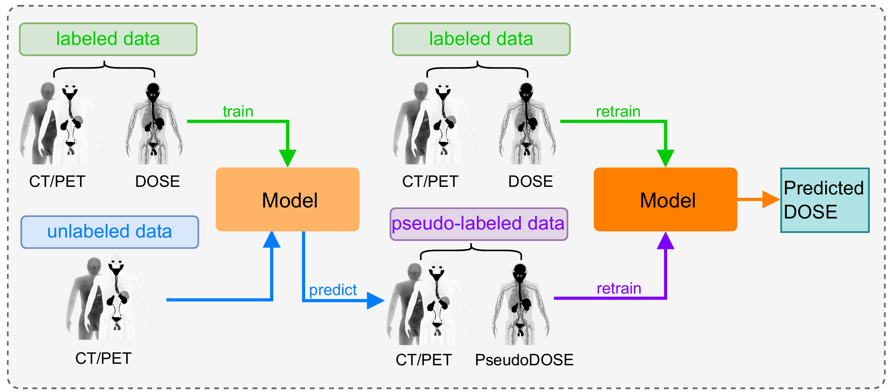

# SemiDose
**SemiDose: Dose prediction in targeted radionuclide therapy using semi-supervised learning from pre-therapy synthetic phantoms.**



👉 The paper has been accepted in [place](www).  

👉 Code:    
* [requirements.py](./src/requirements.py), necessary Python libs    
* [data_load.py.py](./src/data_load.py), load dataset
* [model_load.py](./src/model_load.py), load model
* [hyper_parameter.py](./src/hyper_parameter.py), hyper-parameters
* [train_regfixmatch.py](./src/train_regfixmatch.py), model training, validation and test process

⭐ Highlights:    
* We develop an effective radiotherapy dose estimation method based on semi-supervised deep learning.
* We propose a new pseudo-label generation algorithm in SSL that can better adapt to regression-based tasks.


### Requirements

* Python 3.*  
* Pytorch 1.x or 2.0

### Citation

```

```
