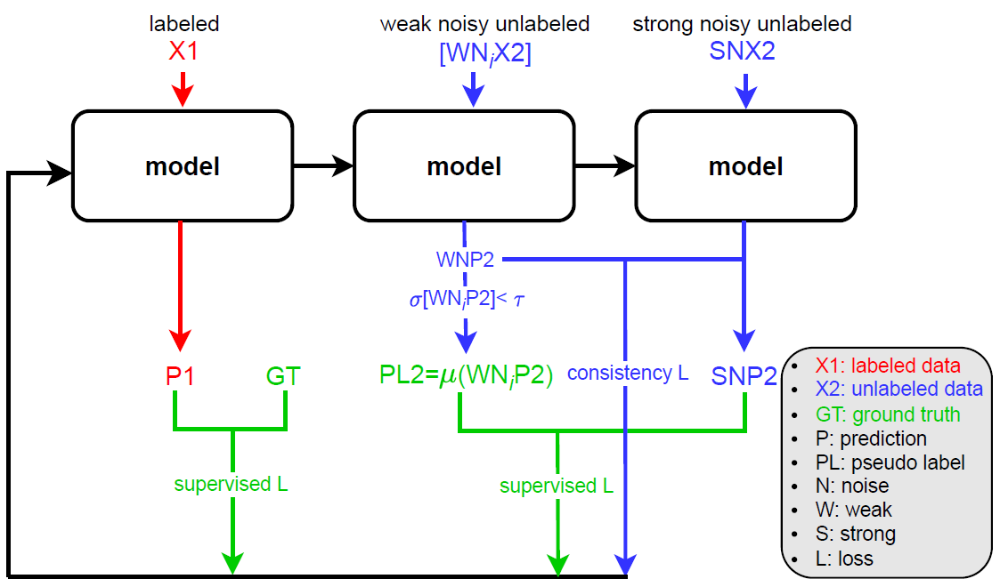

# RegressionSSL
**RegressionSSL: A semi-supervised learning method for fast dose calculation in medical physics.**



👉 The paper has been accepted in [place](www).  
👉 The paper can be viewed on [ResearchGate](rg).  

👉 Code:    
* [regfixmatch.ipynb](regfixmatch.ipynb) (for editing)    
* [main5.py](main5.py) (for training)

Highlights:    
* We develop an effective radiotherapy dose estimation method based on semi-supervised deep learning.
* We propose a new pseudo-label generation algorithm in SSL that can better adapt to regression-based tasks.


### Requirements

* Python 3.*  
* Pytorch 1.x or 2.0

### Citation

```
@inproceedings{regfixmatch,  
  title={},  
  author={},  
  booktitle={},  
  pages={},  
  year={},  
  organization={}  
}
```
